# *Robust Optimization for Emergency Medical Supply Allocation under Uncertain Disaster Demand: Comparison with Deterministic and Stochastic Models*

2025 ORA  
林敬原, Iman Ouahbi, Duncan

# **Background and Motivation**

## **Motivation:**

Natural disasters are becoming more extreme—earthquakes, floods, fires, and so on. Hospitals need prepared supplies to deal with the potential patients, and the demand can surge rapidly. Making decisions based on average demand may not be enough and can even be ineffective, leaving people without immediate treatment. Therefore, we need an approach that can handle worst-case scenarios

## **Background**: 

Hospitals are very vulnerable to natural disasters. Natural disasters cause extreme variability patient demand while operating under limited resources. Therefore it is important that hospitals allocate enough resources beforehand, under incomplete information. A traditional approach would be to always have enough resources ready to cover for the worst case scenario with the most extreme levels of demand. This guarantees feasibility but it leads to inefficient use of resources and high costs, especially when there is a storage cost. On the other hand however covering for only the expected demand risks shortages of resources during periods of extreme demands. 

To find a better solution for a problem like this the framework of Robust Optimization is more suitable, which aims to protect against uncertain demand while also prioritizing cost efficiency. RO optimizes decisions against worst case scenarios within predetermined uncertainty sets. The performance of the models depend on how the uncertainty is modelled, since overly conservative uncertainty sets lead to high costs while uncertainty sets with smaller ranges are too risky.

## **Problem Definition:** 

This study develops a robust optimization model to decide how many emergency medical supplies should be allocated among hospitals within a given region before a natural disaster. So the number of patients will not be known. The objective is to minimize the risk of shortages of bed resulting from uncertainty. Also, we will compare RO model with stochastic programming model and deterministic linear programming model.

# **Methodology:**

## **Method Justification**

**Deterministic Linear Programming (LP):** The LP model serves as a baseline. It assumes perfect information where the demand is fixed at its expected value. While computationally efficient, this method ignores the variability of disaster scenarios. In reality, actual demand often deviates from the mean, leading to severe shortages and high penalties in worst-case scenarios.

**Stochastic Programming (SP)**:SP incorporates uncertainty by considering a set of discrete scenarios, each with a known probability. It aims to minimize the expected total cost across all scenarios. Although SP provides a more realistic allocation than LP, it relies heavily on the accuracy of the probability distributions and requires a large number of samples to be representative. Furthermore, SP focuses on "average" performance, which might not offer sufficient protection against extreme, low-probability disaster events.

**Robust Optimization (RO):** Robust Optimization addresses this by minimizing the cost in the *worst-case* scenario within a predefined "Uncertainty Set". RO does not assume a specific probability distribution but rather constructs a bounded set (e.g., Box Uncertainty) where the true parameters lie. This approach guarantees a certain level of protection (robustness) against parameter perturbations, making it highly suitable for disaster management where data is scarce or unreliable.

## **Mathematical Formulation**

Table of parameters.

| Parameter | Meaning |
| :---- | :---- |
| (Dh,s) | Demand at hospital h in scenarios |
| (challoc) | Allocation cost per unit |
| (p) | Shortage penalty  |
| (Caph) | Maximum supply hospital can host |
| (SurgeCaph) | Maximum supply hospital can host in surge |
| (chsurge) | Surge Allocation cost per unit |
| K | Total preposition stock |

The uncertainty factor in our problem is demand for each hospital. In different scenarios, there are different demands for each hospitals.

Table of Decision 

| DVs | Meaning |
| :---- | :---- |
| xh | pre-positioned units allocated to hospital h. |
| yh,s | surge units sent to hospital h in scenario s. |
| uh,s | shortage (supply unmet demand) at hospital h in scenario s. |
| oh,s | surplus (supply over demand) at hospital h in scenario s. |

**Deterministic Linear Programming (LP):**   
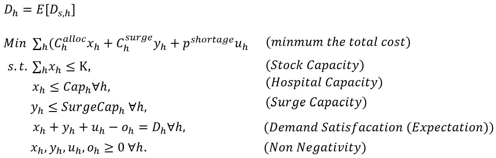 
Stock Capacity: the total allocation units cannot exceed the total preposition stock.  
Hospital Capacity: allocation cannot exceed hospital capacity.  
Surge Capacity: surge units cannot exceed surge capacity.  
Demand Satisfaction: the allocation units \+ surge units \+ shortage units \- surplus units should be equal to demand.

This model will ignore the risk of the variability of disaster scenarios. Especially for those extreme scenarios that happen in a low chances, although the demand might be high, it won’t make this model become a lot conservative, as it’s weight is low.

**Stochastic Programming (SP)**:  
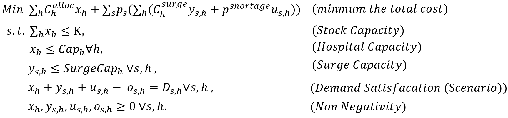
Instead of a single fixed cost, it minimizes the first-stage allocation cost plus the *expected* second-stage cost. The meaning of the  constraints is similar to the LP, but it consider different scenario’s demand and have more constraints in consequence (for each demand, e.g. Surge Capacity, Demand Satisfaction, Non Negativity).   
While this model improves upon the deterministic approach by incorporating variability and probability, it focuses on optimizing the average performance. Consequently, it may still result in high costs or significant shortages in extreme, low-probability "tail" events. Its effectiveness also heavily depends on whether the sampled scenarios

**Robust Optimization (RO):**   
The RO model aims to cover the worst-case scenario and then minimize the total cost. Unlike the SP model, which optimizes based on an average (expectation), the RO model seeks a solution that remains feasible and cost-efficient even under the most extreme demand realizations within a defined uncertainty set.  
The general form of this problem can be written as a "Min-Max-Min" formulation:  
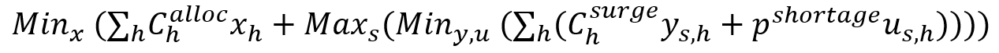 
As the maximum part (finding the worst-case scenario) is not linear, we cannot solve it directly with standard Linear Programming solvers. To address this, we reformulate the problem by introducing an auxiliary variable Z,, which represents the **worst-case recourse cost**. We then constrain Z to be greater than or equal to the recourse cost of *any* possible scenario in the uncertainty set.

This transforms the complex nested optimization into the following linear formulation.

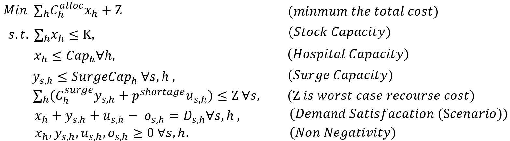

However, when applying the **Box Uncertainty Set** or **EV-Box Uncertainty Set** in this case, the problem can be simplified significantly. These uncertainty sets assume that the demand for each hospital is independent.

Since the recourse cost (comprising surge costs and shortage penalties) is monotonically increasing with demand, we can determine that the worst-case scenario occurs precisely when the demand reaches its **Upper Bound** for all hospitals simultaneously.

Therefore, the Z variable (Worst-Case Cost tracker) becomes redundant, and the complex robust formulation collapses into a deterministic model. This simplified model is structurally identical to the Expectation Deterministic (LP) model, with one critical difference: the demand parameter used is not the expectation but the upper bound of demand.

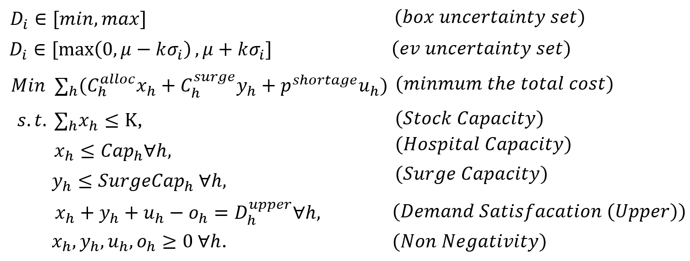
Under this formulation, the model is still aimed at facing the worst case. Even though the mathematical structure now resembles a standard deterministic linear program, it is effectively securing the system against the most extreme demand outcome defined by our uncertainty sets.   
By optimizing for the upper bound demand, we implicitly guarantee that any other demand scenario will also be covered without exceeding the calculated worst-case cost. 

# **Data Collection and Analysis Result**

## **Data Collection:** 

The dataset used in this study **is synthetically generated continuous demand data**, representing hospital resource allocation requirements under multiple disaster scenarios. There are 3 hospitals and 8 disaster scenarios, including a baseline scenario in which no disaster occurs. Each scenario has its own probability**. Each disaster scenario has multiple continuous demand realizations, 50 continuous demand samples are generated per disaster scenario.** As a result the dataset reflects systematic and random uncertainty in hospital demand. **Each hospital has its own fixed capacity, (220 for H1, 160 for H2 and 140 for H3), and costs with resource allocation cost and surge cost.** Another type of cost is shortage penalty, which is a penalty induced when a hospital does not have enough resources to cover for the demand. Demand consists of 2 stochastic components, a regional component which is correlated across hospitals and represents shocks that influence all hospitals together, and an idiosyncratic component which captures randomness specific to each hospital.

This data supports a two-stage decision-making process under uncertainty, with bed capacity and resource allocation costs as first-stage decisions, and surge costs and shortage penalties as second-stage decisions. We roughly base our assumption of a 15% surge capacity on general guidance for hospital bed management (NCBI, 2018).

With this dataset we can evaluate models such as LP, SP and RO. 

### **Uncertainty sets**

To properly evaluate robust optimization modelling, we construct uncertainty sets from the datasets. These uncertainty sets are the demand ranges that the models must be feasible for. In this case we consider 2 models to construct uncertainty sets, min-max box uncertainty sets and expected value EV-centered box uncertainty sets. These are constructed from the continuous dataset using mean, minimum, maximum and standard deviation of the demand. These statistics are used for determining lower and upper bounds.

#### **Min-Max Box Model:**

As the name suggests the min-max box model constructs uncertainty sets by having the lower bound be the minimum of the observed demand and the upper bound being the maximum of the observed demand. Mathematically, the uncertainty sets are denoted as:

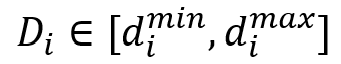

For each hospital.

An uncertainty set like this would be overly conservative, as the results are:

| Model | Level | Hospital | Lowerbound | Upperbound |
| :---- | :---- | :---- | :---- | :---- |
| Min-Max | 1 | H1 | 0 | 217 |
| Min-Max | 1 | H2 | 0 | 162 |
| Min-Max | 1 | H3 | 0 | 136 |

 

It is feasible for even the most extreme demands but not very cost-efficient, that’s why we introduce a variable , which is the level and it takes values between 0 and 1\. An  of 1 corresponds to the full observed demand range, so lowering the value of  will shrink the interval. We tune the degree of conservatism by lowering the value of  to 0.75, leading to higher risk but better cost efficiency.

| Model | Level | Hospital | Lowerbound | Upperbound |
| :---- | :---- | :---- | :---- | :---- |
| Min-Max | 0.75 | H1 | 27 | 190 |
| Min-Max | 0.75 | H2 | 20 | 142 |
| Min-Max | 0.75 | H3 | 16 | 119 |

 

#### **EV-Model:**

The EV-box uncertainty sets are constructed around the mean demand, mathematically the model for the uncertainty sets is denoted as:

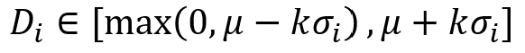

Where  denotes the mean of the demand and  denotes the standard deviation of the demand. The parameter k determines how many standard deviations from the mean are included in constructing the uncertainty sets. K \= 0 would imply a deterministic model centered at the expected demand, and larger values of k would increase variability and risk coverage. Unlike the min-max model, the EV-model reflects variability rather than extreme values. A value of k \= 1 intuitively seems to create the best uncertainty sets, resulting in:

| Model | Level | Hospital | Lowerbound | Upperbound |
| :---- | :---- | :---- | :---- | :---- |
| EV | 1 | H1 | 42 | 153 |
| EV | 1 | H2 | 34 | 112 |
| EV | 1 | H3 | 24 | 92 |

## Analysis

We conducted a baseline comparison experiment with the following parameters:

* **Total Preposition Stock (K):** 220 units.  
* **Shortage Penalty:** 8 per unit.  
* **Surge Capacity:** Set to 15% of each hospital's capacity.  
* **Other Parameters:** Follow the synthesized dataset as described in Data Collection section.

**Deterministic (LP) & Robust (RO):** These models utilized the **entire dataset** to derive their parameters. The LP model calculated the precise expected demand  across all available data, while the RO model used the full dataset's statistics to construct accurate uncertainty sets and determine the worst-case upper bounds.

**Stochastic Programming (SP):** To simulate a realistic decision-making environment where optimizing over the entire population might be computationally intensive, the SP model was solved using a **random sample of 200 scenarios** drawn from the dataset. As using the entire dataset would result in an more larger model which isn’t efficient in calculation.

The result is as below.

| Model | True Expected Cost | True Worst-Case Cost | Expected Shortage | Worst-Case Shortage |
| :---- | :---- | :---- | :---- | :---- |
| Deterministic (LP) | **436.35** | **3,058.39** | **23.04** | **332.50** |
| Stochastic (SP) | **433.89** | **2,923.53** | **18.01** | **310.00** |
| Robust (RO) | **641.23** | **2,286.04** | **18.87** | **208.00** |
| Perfect Foresight(WS) | **222.16** | **2,269.93** | **5.24** | **205.00** |

EVPI \= 211.73  
VSS \= 2.46  
True Expected Cost(RO) \- True Expected Cost(SP) \= 180.34  
True Worst-Case Cost(SP) \- True Worst-Case Cost(RO) \= 637.49 

While standard stochastic planning (SP) provides little advantage over deterministic planning for *average* outcomes (low VSS), the Robust Optimization (RO) model demonstrates immense value for *extreme* events. The system effectively achieves a 3.5x return on investment in risk mitigation (avoiding 637.49 in potential losses for a cost of 180.34), making RO the superior choice for emergency relief where preventing catastrophic failure is paramount. 

To assess the robustness of the hospital disaster response system and understand how different parameters influence model behavior, we conducted a comprehensive sensitivity analysis. We focused on three key dimensions: the design of the uncertainty sets, the impact of total pre-positioned stock capacity, and the sensitivity to shortage penalty costs.

#### Different Uncertainty sets:

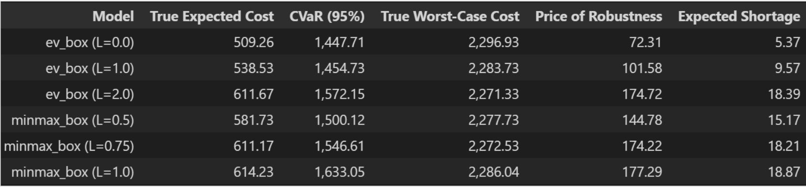

We can observe that, generally, the more conservative the model is, the lower the Worst-Case Cost and the higher the Expected Cost. However, in the case of min max box with L=1.0, its performance is worse than with L=0.75. This may be because the box approach assumes that the worst case occurs independently for each hospital, which may not correspond to the actual worst-case scenario in practice.

#### Increasing stock capacity:

Here we want to analyze how model performance varies when total available stock increases.

- With low penalties for shortages, the models accept a certain level of unmet demand, and increasing stock mainly improves the expected cost.
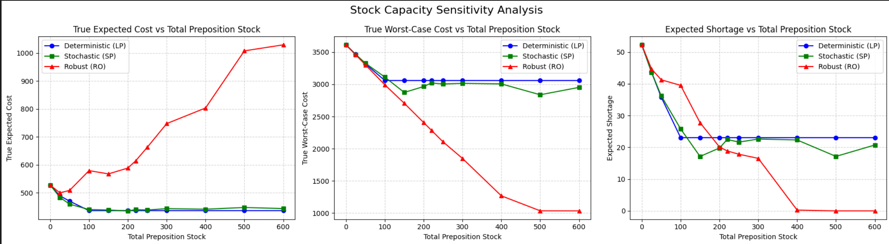

- With high penalties, the robust and stochastic models react more aggressively, allocating resources earlier to avoid shortages.
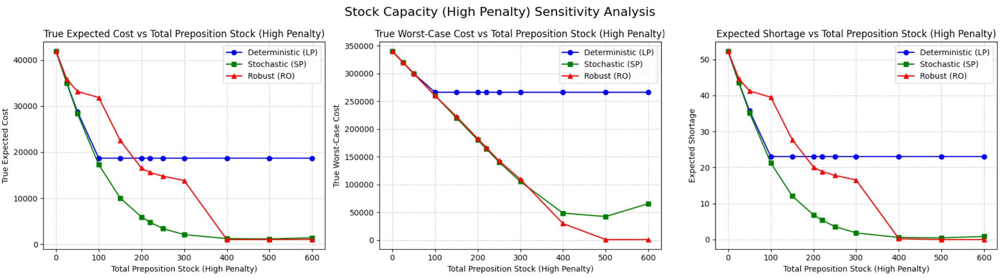

This confirms that total stock capacity does not act in isolation, but rather its effect depends heavily on the penalty regime.

#### Different penalty costs:

#### By increasing the penalty for scarcity, all models reduce unmet demand, but at the cost of higher total costs. A relevant result is that, under high penalties, the stochastic model can approximate the performance of the robust model in worst-case terms, provided that the sample of scenarios is sufficiently representative.

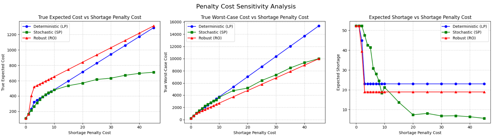

#### This result highlights that the performance of the SP critically depends on the quality of the sampling, while the RO offers explicit guarantees regardless of such representativeness.

#### Comparison between robust variants:

The comparison between different robust optimization configurations under a fixed penalty shows that:

- The most conservative sets reduce the worst-case cost more quickly by increasing stock.

- Sets based on expectation offer a better balance between efficiency and protection.

This confirms that the choice of the level and type of uncertainty is not a technical detail, but a strategic decision that determines the overall behavior of the system.

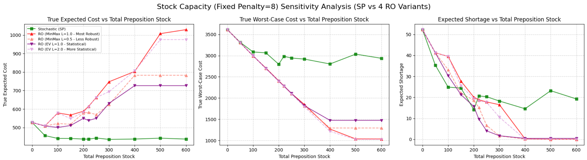

## Managerial Implications

#### Strategic Calibration: Balancing Protection and Cost

Our results show that Robust Optimization (RO) acts as an "insurance policy”, it significantly reduces worst-case losses but incurs a higher expected cost during normal operations. However, "more robust" is not always better. Blindly adopting the most conservative settings (e.g., full Min-Max Box with $L=1.0$) leads to hoarding resources for statistically impossible "perfect storm" scenarios. 

#### Mitigating Model Risk in Stochastic Planning

While our sensitivity analysis suggests that Stochastic Programming (SP) can approximate RO's performance under high penalty regimes, it carries significant Model Risk. SP relies heavily on the accuracy of historical probability distributions and the representativeness of the sample. If real-world disaster probabilities differ from our data or if the sample is insufficient, SP's solution may fail to protect against extreme events. RO, by contrast, provides a mathematical guarantee of feasibility within defined bounds, making it the superior choice for decision-makers who cannot afford to gamble on probability estimates.

#### A Dynamic Model Selection Strategy

We recommend a dynamic approach where the model choice adapts to the nature of the threat:

* **For Rare, Sudden Events (e.g., Earthquakes):** During "peacetime," maintaining strictly conservative RO levels is financially unsustainable. We suggest using a High-Penalty SP or a RO model with smaller uncertainty set. This ensures a baseline of preparedness with lower holding costs for events that may not occur for decades.   
* **For Foreseeable, Unfolding Crises:** When warning signs appear (e.g., a storm trajectory or early infection waves), the strategy should switch to a Strict RO model. In these scenarios, the uncertainty shifts from "if" to "how bad," and the priority must shift entirely from cost-saving to ensuring absolute supply sufficiency.

# **Conclusion**

In conclusion, this study demonstrates that while Deterministic and Stochastic models offer cost efficiency under average conditions, they remain critically vulnerable to extreme disaster scenarios. The Robust Optimization (RO) model, conversely, functions as a vital "insurance policy," accepting a higher expected cost to effectively cap worst-case losses and shortages. However, our sensitivity analysis highlights that blind conservatism is inefficient; a calibrated uncertainty set provides a superior trade-off between protection and budget compared to an overly pessimistic "perfect storm" assumption. Therefore, we recommend a dynamic decision framework: employing cost-effective High-Penalty Stochastic strategies for rare, sudden events to maintain long-term sustainability, while rigorously switching to strict Robust Optimization during foreseeable, unfolding crises to ensure the absolute reliability of the emergency supply chain.

# **Reference**

* National Guideline Centre (UK). (2018). *Bed occupancy* (Chapter 39\) in *Emergency and acute medical care in over 16s: Service delivery and organisation*. National Institute for Health and Care Excellence (NICE). [https://www.ncbi.nlm.nih.gov/books/NBK564920/](https://www.ncbi.nlm.nih.gov/books/NBK564920/)  
* Chenreddy, A., Bandi, N., Delage, E. (2022). *Data-driven conditional robust optimization.* GERAD & Department of Decision Sciences, HEC Montréal; McGill University. [https://papers.neurips.cc/paper\_files/paper/2022/file/3df874367ce2c43891aab1ab23ae6959-Paper-Conference.pdf](https://papers.neurips.cc/paper_files/paper/2022/file/3df874367ce2c43891aab1ab23ae6959-Paper-Conference.pdf)  
* Chen, Z., Peng Xiong. (2023). *RSOME in Python: an open-source package for robust stochastic optimization made easy*. INFORMS Journal on Computing 35(4) 717-724.  
  Chen, Z., Melvyn, S., Peng Xiong. (2020). *Robust stochastic optimization made easy with RSOME.* Management Science 66(8) 3329-3339.  
  [https://xiongpengnus.github.io/rsome/](https://xiongpengnus.github.io/rsome/)  